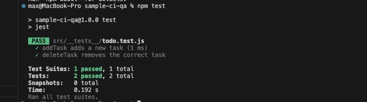

# Software Development Practices Exercise

This project demonstrates **Version Control (Git)**, **Continuous Integration (GitHub Actions)**, and **Quality Assurance (unit tests, linting, code review)**.

## Project Structure
- `index.html` – simple front end for a to‑do list.
- `src/todo.js` – core logic (add, delete, list).
- `src/__tests__/todo.test.js` – unit tests with Jest.
- `.github/workflows/ci.yml` – CI pipeline that runs tests and ESLint.

## Part 1: Version Control
- Repository initialised with `git init`.
- Feature branch `feature/delete-task` was created, a conflict was resolved, and the branch was merged via pull request.
- All commits show clear, descriptive messages.

## Part 2: CI Pipeline
- GitHub Actions is configured to install dependencies, run `npm test` and `npm run lint` on every push and pull request.
- If a test fails, the build turns red and the committer is notified.

## Part 3: Quality Assurance
- **Unit tests**: cover adding and deleting tasks.
- **Linter**: ESLint enforces consistent code style (no unused vars, semicolons required).
- **Code review**: all changes go through pull requests with peer review before merging.

## QA Report
See [QA_REPORT.md](./QA_REPORT.md) for details on tests, linting results, and code review summaries.

## Short Reflection (200-300 words)
*Learning Git was challenging at first, especially understanding merge conflicts and rebasing. However, once I practised with a simple project, the branching model became clear. The CI pipeline gave me instant feedback every time I pushed – if I accidentally broke a test, I knew immediately and could fix it before continuing. This saved a lot of time compared to manually running tests. The linter forced me to write consistent code, and peer reviews taught me to consider readability and edge cases I would have missed on my own.*

*Overall, these practices made our collaboration smoother: we never worried about overwriting each other’s work because branches kept features isolated, and the CI ensured that no broken code was merged. Writing tests also made me more confident when refactoring. The biggest lesson is that tools like Git, CI, and QA are not just for large companies – they help even on small school projects by reducing mistakes and improving teamwork.*
